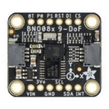

Roadrunners - Future engineers 2024 
====

## Table of Contents

- [Introduction](#introduction)
- [Car Photos](#carphoto)
- [Mobility Management](#Mobility-Management)
    - [Chassis](#Chassis)
    - [Motorization](#Motorization)
    - [Steering Mechanism](#Steering-Mechanism)
- [Power and Sense Management](#Power-and-Sense-Management)  
    - [Power supply](#Power-supply)
    - [Controllers](#Controllers)
    - [Sensors](#Sensors)
    - [Camera](#camera)
    - [Schematics](#schematics)
- [Software Design](#software)
    - [Software Development](#software-development)
    - [Opening Race](#opening-race)
    - [Obstacle Race](#obstacle-race)
    - [Programming Languages](#programming-languages)
    - [Dependencies](#dependencies) 
- [Utilities](#utilities)
    - [Failsafe Mechanisms](#failsafe)
    - [Debugging Tools](#debugging-tools)
- [Assembly](#assembly)  
    - [Bill of Materials](#bill-of-materials)
    - [Assembly Instructions](#assembly-instruction)
- [Team Photos](#team-photos)
- [Demonstration Videos](#demonstration-videos)
- [Contributors](#contributors)
- [Resources](#resources)

## Introduction

Welcome to the official GitHub repository for Team Roadrunners from Germany, participating in the WRO World Finals 2024. This repository contains all the code, documentation, and resources for our project. We have used scoring criteria from the rulebook as headings in our documentation to make it easy to navigate our repository.

## Car Photos

These photos here provide an overview in reduced resolution how our car look like and which components are where.

The high-resolution car photos are found [here](./v-photos/README.md) .

  

 

 

## Mobility Management

### Chassis

We built our car from Lego parts and plastic plates.
The chassis consists of Lego Technic parts. 
We looked in the book ‘The Unofficial LEGO Technic Builder's Guide 2nd Edition’ to find out how to build a car from LEGO, especially how to build a steering system.
Then we developed our own chassis. 
Our first car had a plastic base plate, LEGO parts on it and then another plastic top plate and was rather big.
For the world final, we wanted to try and build a smaller car so that it would be easier to get past the obstacles. 
To do this, we first focussed on building the smallest possible chassis with the smallest possible motors. We only used Lego this year and managed to create a much smaller chassis.
Our new version still consists of a Lego driving vase and a self-designed plastic plate to mount the electronics. We also used the same motor models, wheels and steering servo so we could reuse most of our programs.

 

The photo shows a comparison between our two car versions.
For learners, we provide a detailed assembly instructions [here](./assembly/README.md) 

Last year, we used an Arduino for control and a Pixy2 Smartcam as a camera. The Arduino often reacted slowly and the camera image could not be optimally adjusted.
This year we are using a Raspberry Pi5 with a Pi wide-angle camera. 
There are many electronic components available as stackable HATs for the Raspberry Pi. We have taken advantage of this to save space so that our car can remain smaller.

We also thought that it would be good to be able to see what the car is currently seeing or analysing while driving. This helps to find reasons for errors.
We didn't want to build a display on our car. For once, displays are rather large and heavy and it's not easy to read what's on them when you're standing next to the field. Our idea is to use LEDs in different colours. We built our own LED strip with red and green for the obstacles, blue and orange for the lines and yellow and white to indicate that the car is ready to start.
We later added another red and green LED to indicate the car got the u-turn right.

When testing the obstacle race, we had problems with our car getting stuck on the inside wall in very tight bends. For example: driving in the right-hand direction, a red obstacle on the inside at the very end and another red obstacle immediately after the bend.
When we realised that you are allowed to touch the walls this year, we installed wall rollers at the very end at the front and on the side, which ensure that the car can still squeeze around the corner in most cases if it touches the wall when turning in.

### Motorization

We use Lego Powerfunctions L-Motors as a drive because they are very easy to install in a Lego chassis.

Technical data: 9V, 390 rounds/min with no load, max. torque 1.8 N/cm, max. 1.3A current

In the beginning, we tried to drive with a longitudinally installed Lego XL motor, but it had only 220 rounds/min and was much too slow. We then used an L-motor. Our car worked quite well with that when we were going fast, but got stuck on bumps on the mat when driving slowly. Then we realised that you can drive much more accurately if you drive more slowly. So we used 2 Powerfunctions L Lego motors, because 1 motor alone didn't have enough torque when driving slowly. 

We connected the two engines to each other via a gearbox because the rules state that you can only have two engines if you couple them mechanically. with this motor setup, our car can now on one hand drive slowly enough to be precise and on the other hand drive fast enough to get good race times.

For our new car version, we used smaller gears to build a smaller motor block from the same two L-motors.

 

You need a motor driver so that the Raspberry Pi can control the motors. We used a motor HAT from Adafruit with TB6612 MOSFETs, which can be stacked on the Raspberry Pi's headers. The motor driver shield comes with its own PWM chip to control the motor speed. This hardware PWM control is much more precise as the software PWM provided by the Raspberry Pi itsself.

We then had to connect the motors to the motor driver for the power supply. To do this, we cut off the normal Lego connections and soldered on JST connectors. 
We didn't screw the cut cables directly to the HAT because the power function cable cores are quite thin and don't hold well in the screw terminals.

### Steering Mechanism

For steering, we use a Geekservo Lego-compatible servo, which has a housing like a Lego brick. The Raspberry Pi controls the steering servo via a 16-channel servo HAT from Waveshare. This can be plugged onto the motor HAT so that it doesn't take up any extra space.
You only need one channel of the HAT servo for the servo. We use 6 of the other slots to control our LED strip.

Our car has an Ackermann steering mechanism. The intention of Ackermann geometry is to avoid the need for tyres to slip sideways when following the path around a curve (Wikipedia). It ensures, that all axles point to the center point of the curve.

  

Our previous car had a simple parallel steering mechanism. We tested both variants with our new minified car and found that our can make much tighter turns with the Ackermann steering mechanism.

## Power and Sense Management

### Power Supply

On our car, we have four different voltage levels.
We use a 11.1V lithium-polymer battery (Lipo) for the overall power supply. On our car, we need 9V for the Lego driving motors and 5V for the servo, the LEDs and the Raspberry Pi. The voltage of the battery is not always the same, it drops from 12.6V when fully charged to 9.0 when the battery is empty.
We need always to control the battery level, that we can change the main battery before it is empty. Therefore, we have installed a mini-voltmeter with blue display on our car that that shows the current battery voltage.
We have installed an adjustable step-down converter (XL4015) for the motors, which we have set to a constant output of 9V. The XL4015 needs an input of at least 10.5V to be able to output 9V. 

For everything that needs 5V, we have a step-down converter that has a USB connection for the Raspberry Pi and screw terminals for the servo HAT.
The step-down converter needs at least 7.5V at the input, which is always guaranteed as the battery must be changed before dropping to 7.5V. 

The cameras, the ultrasonic sensor and the gyro sensor are supplied with 3.3V by the Raspberry Pi. 

In our circuit diagram you can see in detail how the components are wired together and supplied with power.

### Sensors

### Controllers

Our main controller is a Rasperry Pi5 4GB. It runs on 5V power supply via USB-C connector. All sensors and cameras run on 3.3V and are powered by the Raspberry Pi's 3.3V output. 
The motor driver is an Adafruit motor shield Adafruit with TB6612 MOSFET, which sits on the Raspberry Pi's stacking headers. 
Logic power from the moto driver comes from the Raspberry Pi. To power the motors, we screwed cables soldered to the output of a XL4015 step-down module to the motor power terminals of the motor shield.
The shield then supplies the motors with the correct amount of power according to the selected speed.
The servo shield is stacked on top of the motor shield and gets its logic power from the Raspberry Pi. The power for the Servo steering motor and the LEDs comes from the same 5V step-down module we use to power
the Raspberry Pi. The module can provide up to 5A current, so we are confident this will be enough for the Pi, the Servo and the LEDs.

### Sensors

We first tought about which ones we could use for which race mode. Last year we already had experience with ultrasonic distance sensors and wanted to use them again.
We decided in favour of the URM09 digital sensors from DFRobot because they can work with 3.3V and because their mounting holes fit Lego.

The Raspberry Pi only has 3.3V logic voltage and most ultrasonic sensors need 5V.
We mounted an ultrasonic sensor at the front of each side to measure the distances to the side walls and one to the front to measure the distance to a wall opposite.
We then considered that we would have to recognise the lines in the obstacle race in order to find the bends. Only with the distances to the side could you measure an obstacle that is directly behind the bend and then miss the bend. 
We also wanted to be able to recognise in which direction the car has just turned and how far it has already turned overall. For this we need a gyro sensor or an IMU sensor.

One problem with gyro sensors is drift. The gyro does not return to 0 when turning and turning back and the error increases over time. We have tested various sensors. The Bosch BNO085 worked best. This one has an onboard chip to compensate for the drift.
It also has a specific game-mode, where it calculates the heading direction relative to its starting position.

### Cameras

We have two Raspberry Pi V3 Wide Cameras on our car. The front camera is used to detect walls, lines and obstacles while we drive. The rear camera is used to detect the obstacle, that determines the u-turn and is used to navigate into the parking lot. 
We chose a wide-angle cameras, so that the Raspberry Pi can see as much of the playing field as possible.
Our previous car used two side ultrasonic sensors to find the first corner and then drive along the inside wall at a fixed distance. We then used the gyro to measure when the car had turned 360 degrees 3 times. Then we stopped.
In our obstacle programme, we recognise the walls with the camera and steer straight ahead using the gyro. For fun, we tested how the programme behaves in the opening race. We were surprised to find that it also works and that you can even drive much faster 
because the Raspberry Pi processes the camera images much faster than the ultrasonic sensors can measure. 
We then decided to make another opening version of our obstacle race, in which we removed the obstacle detection and increased the speed.
Once we had managed to set the camera so that orange and red were clearly different, it worked (see chapter on obstacles). So for our minified new car version, we omitted the side ultrasonics to save space.

### Debugging LEDs

Our car has a self-constructed LED-strip on its back for test feedback.
The LEDs show what the car is currently seeing: blue/orange for lines, red/green for obstacles. 
 Programming obstacles
We use Python3 as the programming language and the listing on the right shows the sequence of the main loop.

Main loop
In the obstacle race, we use the camera to analyse the playing field and the gyro sensor to determine the orientation of the car.
We use the OpenCV and Numpy libraries for image processing. To read the gyro and drive and control the car, we used libraries from Adafruit Circuitpython.
We read the next camera image and cut off the top edge in order to minimise the amount of the image that does not belong to the playing field. 
The camera delivers the image in BGR (blue-green-red) format. In order to be able to filter out colours better, the image is also converted into an HSV (Hue Saturation Value) format.
We filter the black walls from the BGR image and calculate whether there is a risk of collision on the right or left.
We filter the lines and obstacles from the HSV image.
We use the lines to calculate the current straight ahead gyro course.
We use this information to determine the next control movement.

Determining the next control movement
Avoid the wall first: 
If the collision alarm is set on one side, we steer hard away from the wall.
 
Then avoid an obstacle: 
If there is an obstacle in the image and there is no line at the bottom of the image, steer so that the obstacle in the image moves all the way to the left (red) or all the way to the right (green).
The camera will lose the obstacle from the picture before we are completely past it. We therefore remember that we are steering by obstacle and the time.

If the obstacle is no longer visible, we continue for a timeout in the last direction past the obstacle.
Then we reset the ‘Obstacle’ flag.

If there is no wall and no obstacle control:
Steer by gyro to the straight ahead direction in degrees

If an obstacle is visible and at the same time there is a line at the bottom of the screen (in the colour of the direction of travel), the obstacle is directly behind the curve. We then drive up to the line before we swerve out of the way. Otherwise, the car may no longer see the wall and swerve inwards to avoid the obstacle before it has passed the inside corner. 

Processing the walls
We filter out the parts of the BGR image that appear very dark in all 3 colour channels at the same time. This results in a black and white mask in which the walls are white and everything else is black.
As a measure of how close we are to a wall, we take the height of the wall in the image. Due to the perspective, nearer parts of the wall appear higher in the picture than those further away.
We now split the wall mask in the centre into a wall image on the left and a wall image on the right. To determine the height, we use numpy to count the sum of all pixels in each image column. 
Since black = 0, only the white pixels are counted. We then determine the maximum value for each page.
If the maximum value for one side is too high, we set a flag to True for collision alarm for that side. If there is a collision alarm on both sides at the same time, the car drives directly towards a wall. 

In addition, we return the height for each side as control information.
We first tried to filter the walls using the HSV image. However, this did not work so well as black is not a colour in the Hue range.
Then we tried to use a greyscale image that only shows the brightness. 
This doesn't work so well either, because the blue lines and green obstacles often appear very dark in the greyscale image and would then be mistaken for walls.
This effect can be avoided with the BGR image because the blue lines in the blue channel and the green obstacles in the green channel appear lighter and can therefore be filtered out.  

Processing the obstacles
To recognise the obstacles, we first filter red areas and green areas from the HSV image, resulting in a black and white mask for red and one for green.
The obstacles appear white on a black background. We apply a blur effect so that there is no noise in the masks.
Then, as with the lines, we invert the masks so that the obstacles appear black on white. Then we use the Simple Blob Detector again to find black ‘blobs’ on the masks. 
For each colour, we then go through the list of blobs found and note the largest blob. Then we compare the largest red blob with the largest green blob.
The largest of the two is the next obstacle.
We use slightly different parameters for the blob detector for the obstacles than for the lines. 
For the control, we then supply the x and y position of the blob centre point and the size of the blob in pixels.

Processing the lines
The lines are used to determine the direction of travel, how many corners have already been travelled and the current straight-ahead course according to Gyro.
During the race, we cut out a small area at the bottom centre of the HSV image. We only look for the lines in this area. 
If a line appears in this area, the car is almost on the line. To find a line, we filter out the colour of the line in the HSV image. 
The result is a black and white mask in which the line appears white. Then we convert the mask with Opencv so that it becomes a sharp line on white.
Then we apply the OpenCV function Simple Blob Detector, which can find black areas on a white background. 
We set a minimum size of pixels from which the Simple Blob Detector should recognise the line. The line is then fully in the image.
As the camera cannot look right in front of the wheels, we find the line just before the car drives over it.

We start by looking for orange and blue. As soon as the first line has been found, we remember the direction of travel and only search for this colour.
We then set a short timeout before evaluating the line found. This means that the line is only analysed when the car actually drives over it.
When evaluating the line, we count the number of lines already found.
We then calculate the straight-ahead direction in degrees as number_lines*90 for the direction of travel to the right or number_lines* (-90) for the left.
This means that our car automatically drives round the bend when it steers back to the gyro after the line.

## Assembly

### Bill of Materials

- Raspberry Pi5 4 GB
- Adafruit 

## Resources

