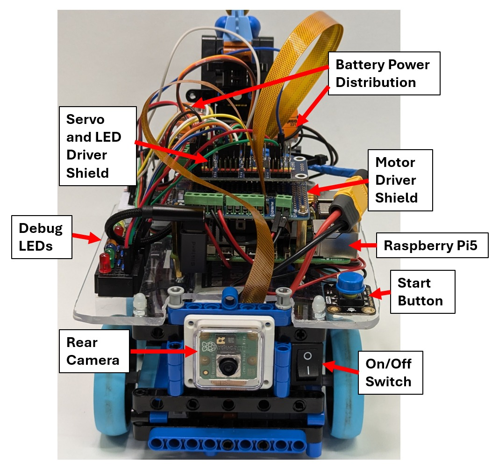
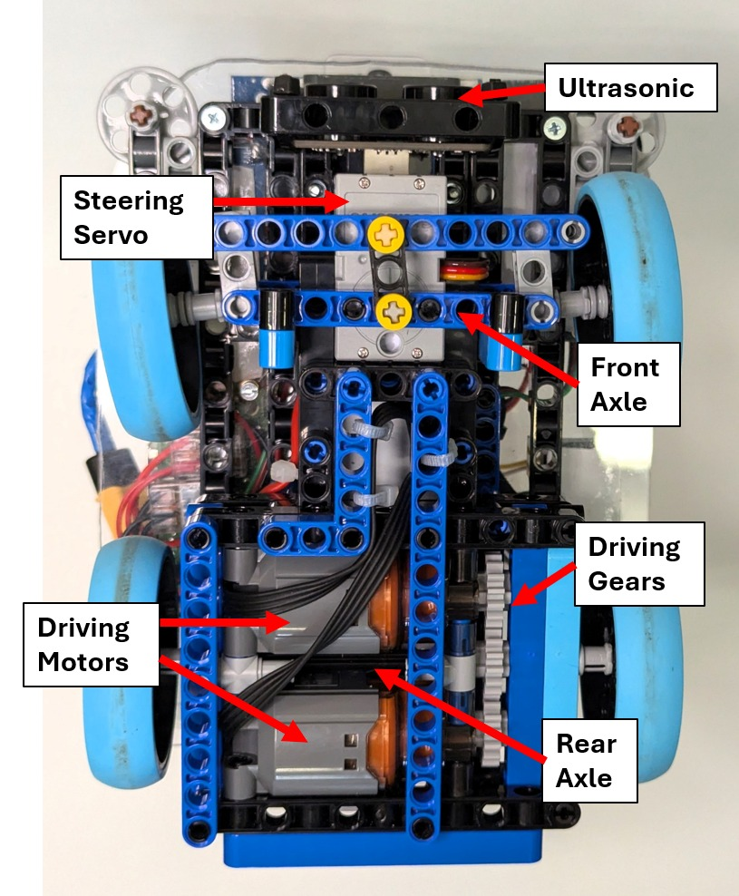
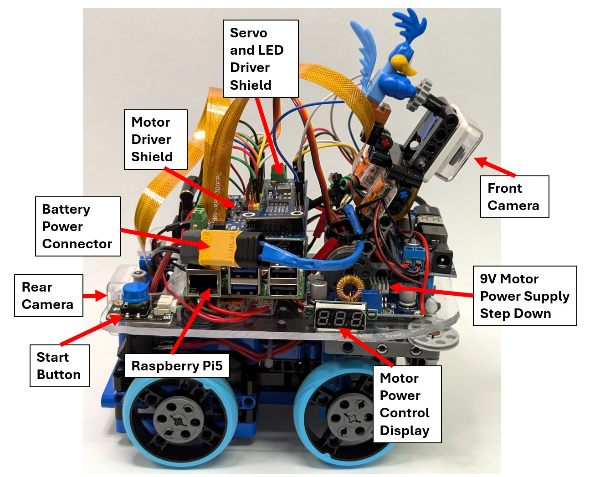
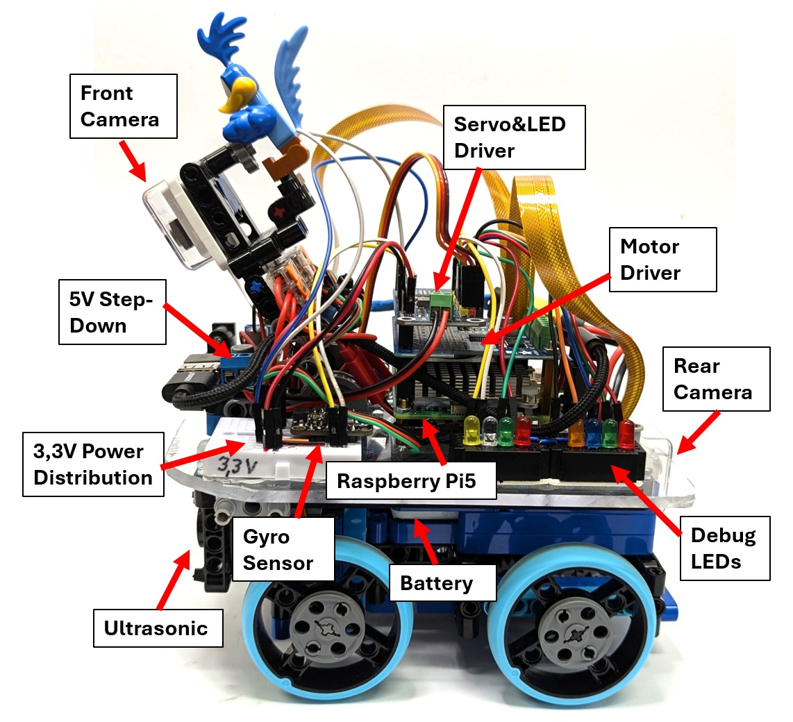

# 
Car Photos

In this section, we show photos of our car from all angles, one set with explaination labels and one set witout labels.

## High resolution car photos without labels

## High resolution car photos with labels

[Back to main page](../README.md)
