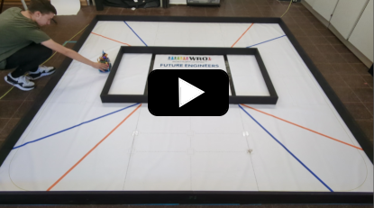
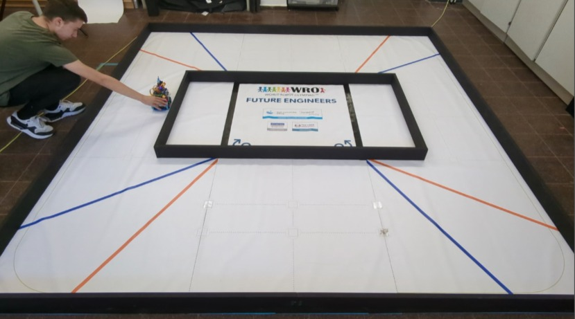

## 
Performance Videos
 

- ### Open Challenge
Video 1: Narrow - Wide - Narrow - Wide

Video 2: Narrow - Wide - Wide - Narrow

[Open Challenge Video2](open2.png)(https://youtu.be/laptwTRzWzo?si=Pb4UfQdD5Fco0qD1)

- ### Obstacle Challenge

Video 1: No U-turn

[Obstacle Challenge Video1](obstacle1.png)(https://youtu.be/BXc-rboRti8?si=dm9C6TamQ3Nrlfux)

Video 2: With U-turn

[Obstacle Challenge Video2](obstacle2.png)(https://youtu.be/xWzXfCR_uqE?si=9jsWWTOr0A01JLgW)

- ### Explaination Video
  This video explains our obstacle race
  
[Explaination Video](explain.png)(https://youtu.be/l9uCbAnm-bI?si=nqA8EYk6vf6BFxaE)

- ### Open Challenge
 

- ### Obstacle Challenge

[Back to main page](../README.md)

